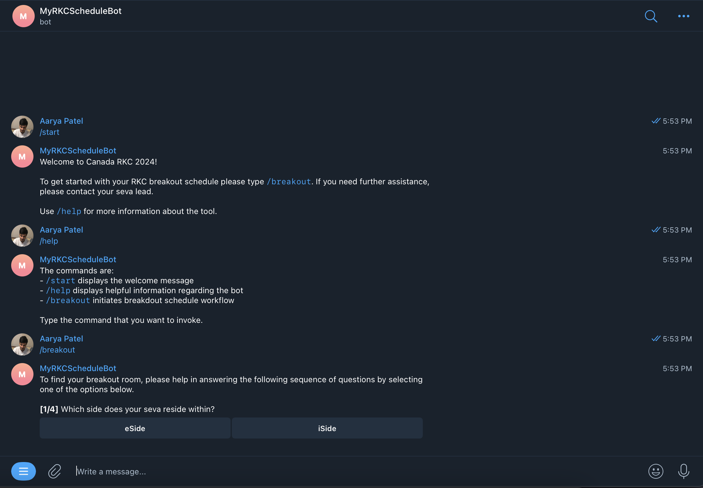

# MyRKCScheduleBot
Telegram Bot for 2024 RKC in Golang

# Installation
1. Install `ngrok` and run `ngrok http 8080`
2. Run `source ./scripts/dev.sh` with the tunnel link generated by `ngrok`
3. Run `go run cmd/main.go`

# Screenshots

https://github.com/Aarya-Patel/MyRKCScheduleBot/assets/32047299/2016437b-70ba-42e2-8467-ce13f5d5b7fd

